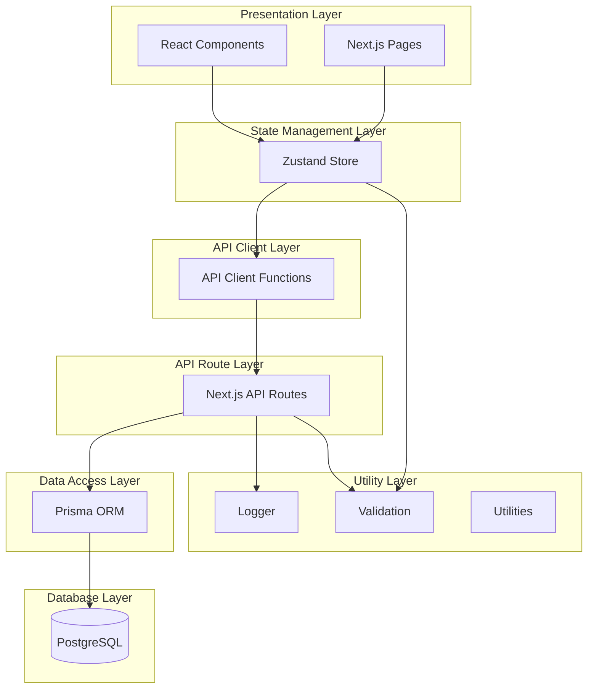
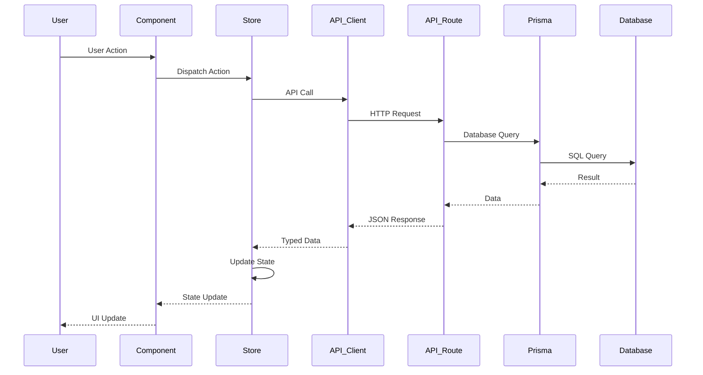
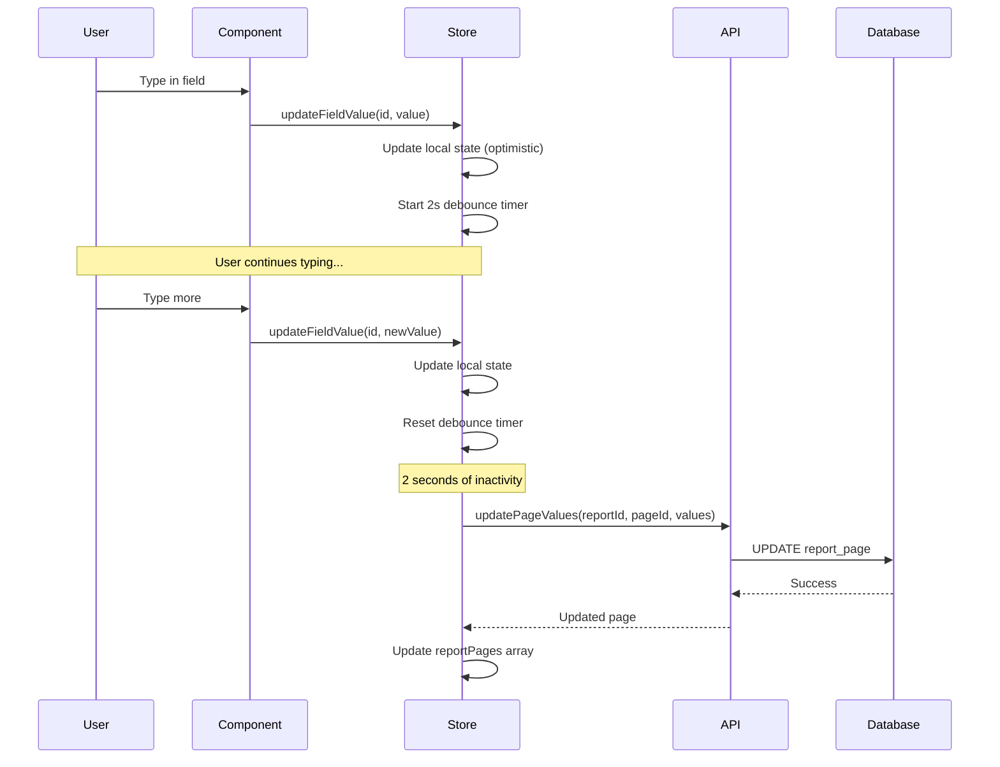
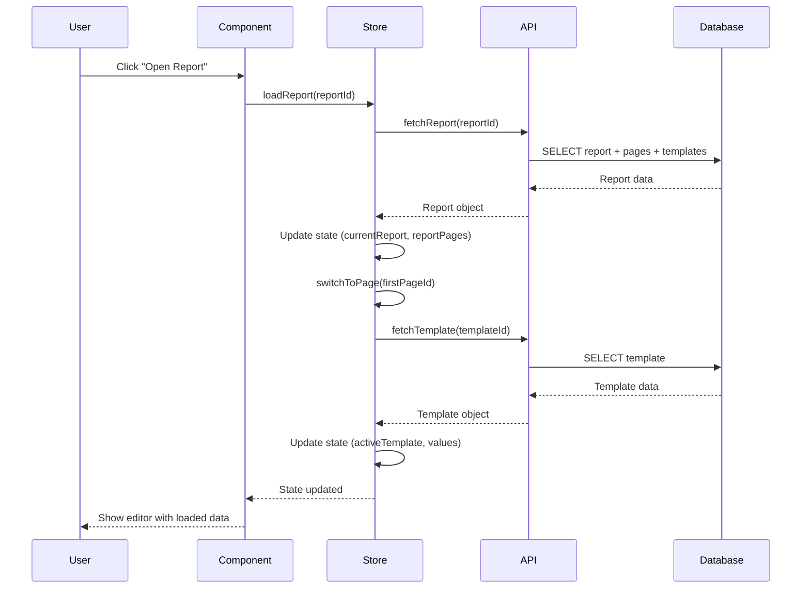
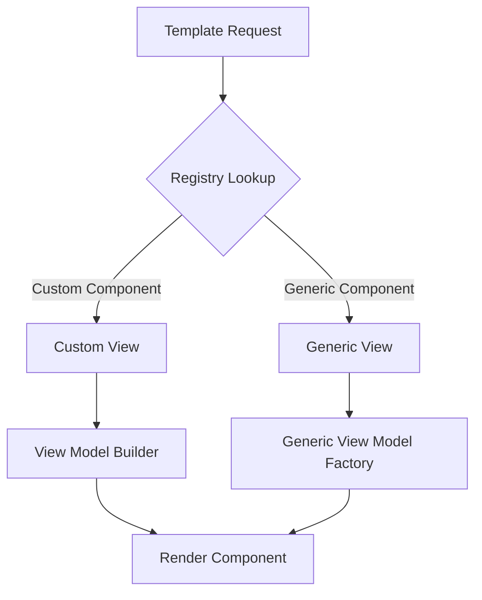
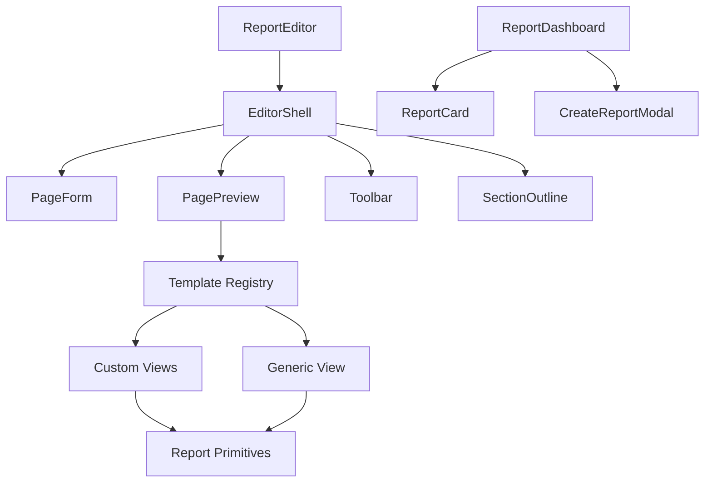
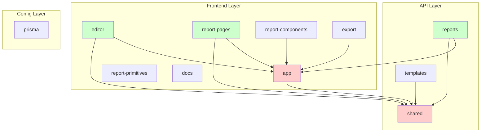
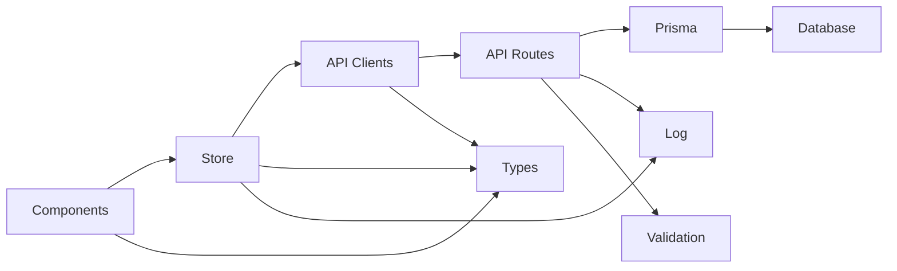
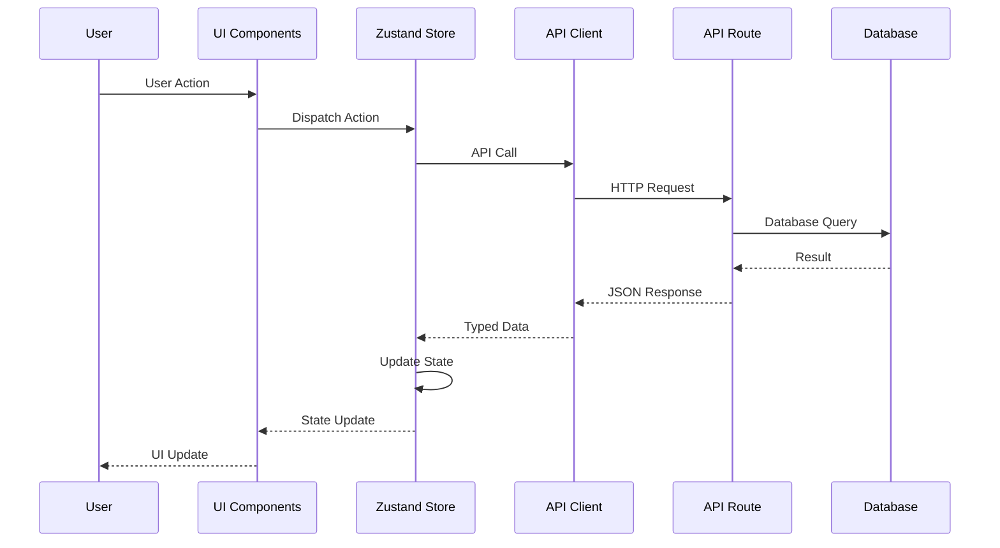
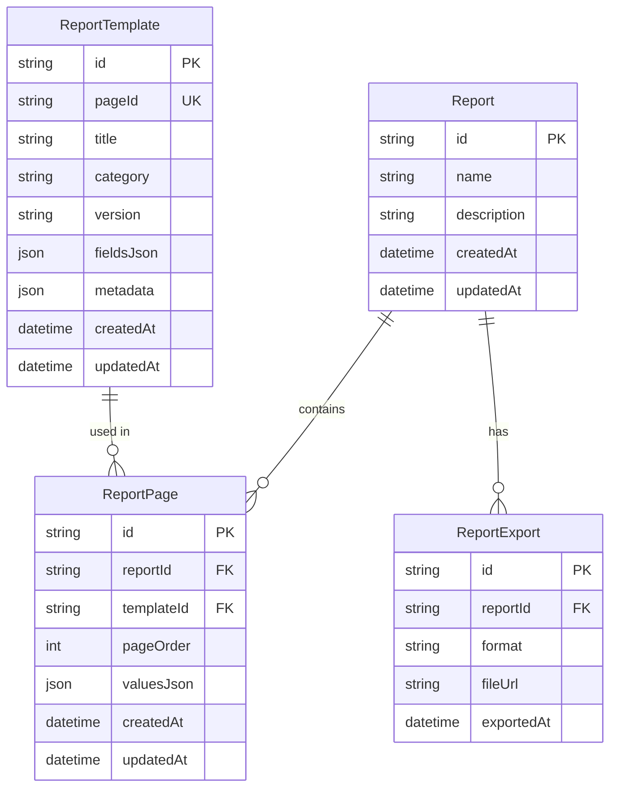

# System Architecture Documentation

## Executive Summary

The editor-test application is a Next.js 15-based multi-report editor system designed for construction industry document generation. The architecture follows a layered, unidirectional data flow pattern with clear separation of concerns. The system supports 100+ report templates through a hybrid approach combining custom components for legacy templates and generic rendering for scalability.

**Key Technologies:**
- **Framework**: Next.js 15 (App Router, React 19)
- **Database**: PostgreSQL with Prisma ORM
- **State Management**: Zustand
- **Validation**: Zod
- **Styling**: Tailwind CSS 4
- **Package Manager**: pnpm

**Architecture Pattern**: Layered Architecture with Unidirectional Data Flow

---

## System Overview



---

## Architectural Layers

### 1. Presentation Layer

**Location**: `app/components/`, `app/*/page.tsx`

**Purpose**: UI rendering and user interaction

**Components**:
- **Editor Components** (`app/components/editor/`): Editor shell, form inputs, preview
- **Report Components** (`app/components/reports/`): Dashboard, report management UI
- **Report Pages** (`app/components/report-pages/`): Template-specific renderers
- **Report Primitives** (`app/components/report-primitives/`): Reusable UI primitives
- **Pages** (`app/*/page.tsx`): Next.js route pages

**Key Characteristics**:
- Client-side React components ("use client")
- Subscribe to Zustand store for state
- Dispatch actions to store on user interactions
- No direct database access
- Minimal business logic (delegated to store/services)

**Dependencies**:
- `@/lib/store` - State management
- `@/lib/types` - Type definitions
- `@/lib/api/*` - API client functions (some components)
- `@/lib/log` - Logging utilities

---

### 2. State Management Layer

**Location**: `lib/store.ts`

**Purpose**: Client-side state management and data synchronization

**Key Features**:
- **Multi-report Support**: Manages multiple reports and pages
- **Optimistic Updates**: Immediate UI updates before server confirmation
- **Auto-save**: Debounced automatic saving (2-second delay)
- **Legacy Compatibility**: Maintains backward compatibility with old API

**State Structure**:
```typescript
interface EditorState {
  currentReportId: string | null;
  currentReport: ReportDB | null;
  currentPageId: string | null;
  activeTemplate: ReportTemplateDB | null;
  values: FieldValues;
  reportPages: ReportPageDB[];
  isLoading: boolean;
  isSaving: boolean;
}
```

**Key Actions**:
- `loadReport(reportId)` - Load report with all pages
- `createReport(name, description)` - Create new report
- `switchToPage(pageId)` - Switch to different page
- `updatePageValues(values)` - Update field values with auto-save
- `addPageToReport(templateId)` - Add new page to report
- `reorderPages(pageIds)` - Reorder pages in report

**Dependencies**:
- `zustand` - State management library
- `@/lib/types` - Type definitions
- `@/lib/log` - Logging
- `@/lib/persistence` - LocalStorage persistence (legacy)
- `@/lib/api/reports` - Report API client
- `@/lib/api/templates` - Template API client

**Architectural Notes**:
- Single source of truth for editor state
- Handles both new database-backed and legacy localStorage flows
- Debounced auto-save reduces API calls
- Optimistic updates improve perceived performance

---

### 3. API Client Layer

**Location**: `lib/api/`

**Purpose**: Frontend data access abstraction

**Components**:
- `lib/api/reports.ts` - Report CRUD operations
- `lib/api/templates.ts` - Template CRUD operations

**Key Features**:
- Type-safe API interfaces
- Consistent error handling
- Request/response transformation
- Reusable fetch functions

**Functions**:
- `fetchReports(params)` - List reports with pagination
- `fetchReport(reportId)` - Get single report
- `createReport(data)` - Create report
- `updateReport(reportId, data)` - Update report
- `deleteReport(reportId)` - Delete report
- `addPageToReport(reportId, templateId)` - Add page
- `updatePageValues(reportId, pageId, values)` - Update page values
- `fetchTemplates(params)` - List templates
- `fetchTemplate(pageId)` - Get single template

**Dependencies**:
- `@/lib/types` - Type definitions
- Native `fetch` API

**Architectural Notes**:
- Thin abstraction layer over HTTP
- No business logic (delegated to API routes)
- Consistent error handling patterns
- Type-safe with TypeScript interfaces

---

### 4. API Route Layer

**Location**: `app/api/`

**Purpose**: Server-side data access and business logic

**Endpoints**:

#### Templates API
- `GET /api/templates` - List templates (pagination, search, filtering)
- `GET /api/templates/[id]` - Get single template
- `POST /api/templates` - Create template
- `PUT /api/templates/[id]` - Update template
- `DELETE /api/templates/[id]` - Delete template

#### Reports API
- `GET /api/reports` - List reports (pagination, search)
- `GET /api/reports/[id]` - Get single report with pages
- `POST /api/reports` - Create report
- `PUT /api/reports/[id]` - Update report metadata
- `DELETE /api/reports/[id]` - Delete report (cascade)

#### Pages API
- `GET /api/reports/[id]/pages` - Get all pages in report
- `POST /api/reports/[id]/pages` - Add page to report
- `GET /api/reports/[id]/pages/[pageId]` - Get single page
- `PUT /api/reports/[id]/pages/[pageId]` - Update page values
- `DELETE /api/reports/[id]/pages/[pageId]` - Remove page
- `PATCH /api/reports/[id]/pages/reorder` - Reorder pages

**Key Features**:
- Input validation with Zod schemas
- Consistent error handling
- Pagination support
- Search and filtering
- Proper HTTP status codes
- Logging for traceability

**Dependencies**:
- `@/lib/prisma` - Database client
- `@/lib/log` - Logging
- `zod` - Validation

**Architectural Notes**:
- RESTful API design
- Server-side validation
- No direct database queries from client
- Proper error responses with status codes

---

### 5. Data Access Layer

**Location**: `lib/prisma.ts`

**Purpose**: Database access abstraction

**Implementation**:
- Prisma Client singleton pattern
- Global instance in development (prevents connection exhaustion)
- Type-safe database queries

**Key Features**:
- Type-safe queries
- Relationship handling
- Transaction support
- Connection pooling

**Dependencies**:
- `@prisma/client` - Generated Prisma client

**Architectural Notes**:
- Single database client instance
- All database access through Prisma
- Type-safe queries prevent runtime errors
- Connection pooling handled by Prisma

---

### 6. Database Layer

**Location**: `prisma/schema.prisma`

**Purpose**: Persistent data storage

**Models**:
- `ReportTemplate` - Template definitions
- `Report` - Report instances
- `ReportPage` - Pages within reports
- `ReportExport` - Export history

**Key Features**:
- PostgreSQL database
- JSON fields for flexible data
- Cascade deletes for data integrity
- Optimized indexes for performance
- Unique constraints for data consistency

**Relationships**:
- Report → ReportPage (one-to-many)
- Report → ReportExport (one-to-many)
- ReportTemplate → ReportPage (one-to-many)

**Indexes**:
- `ReportTemplate.category` - Category filtering
- `ReportTemplate.pageId` - Template lookup (unique)
- `Report.name` - Search functionality
- `ReportPage.reportId` - Report pages query
- `ReportPage.templateId` - Template usage analytics
- `ReportPage[reportId, pageOrder]` - Unique page ordering

---

### 7. Utility Layer

**Location**: `lib/`

**Components**:
- `lib/log.ts` - Structured logging
- `lib/validation.ts` - Zod schemas
- `lib/utils.ts` - Utility functions
- `lib/persistence.ts` - LocalStorage persistence (legacy)
- `lib/types.ts` - TypeScript type definitions

**Key Features**:
- **Logging**: Environment-aware log levels (debug, info, warn, error)
- **Validation**: Runtime type validation with Zod
- **Utilities**: CSS class merging (cn function)
- **Persistence**: LocalStorage fallback for legacy support

---

## Data Flow Architecture

### Unidirectional Data Flow



### Auto-save Flow



### Report Loading Flow



---

## Template System Architecture

### Overview

The template system uses a hybrid approach:
- **Custom Components**: Reports 1-5, 6, 11 have dedicated components
- **Generic Components**: Reports 6+ use generic rendering system

### Template Registry

**Location**: `app/components/report-pages/registry.ts`

**Pattern**: Registry-based component resolution



**Custom Templates** (Reports 1-5, 6, 11):
- Dedicated View component
- Custom ViewModel builder
- Connected component for store integration
- Static metadata

**Generic Templates** (All others):
- Generic Report View component
- Generic ViewModel factory
- Dynamic component resolution
- Metadata from database

### Component Structure

Each template consists of:

1. **View Component** (`ReportXXView.tsx`)
   - Pure React component
   - No state management
   - Receives props from ViewModel

2. **ViewModel Builder** (`reportXXViewModel.ts`)
   - Transforms field values to component props
   - Handles data validation
   - Maps field IDs to properties

3. **Connected Component** (`ConnectedReportXX.tsx`)
   - Connects ViewModel to Zustand store
   - Handles real-time updates
   - Used in editor preview

### Generic Rendering

**Location**: `app/components/report-pages/GenericReportView.tsx`

**Features**:
- Field-based rendering
- Type-aware component selection
- HTML support in multiline fields
- Automatic layout generation

**Supported Field Types**:
- `text` - Plain text
- `multiline` - Rich text with HTML
- `link` - URL links
- `date` - Date display
- `badge` - Styled badges
- `image` - Image display
- `attachments` - File attachment lists
- `authors` - Author information
- `contents` - Table of contents

---

## Component Hierarchy

### Component Organization

```
app/components/
├── editor/              # Editor UI components
│   ├── EditorShell.tsx  # Main editor container
│   ├── PageForm.tsx     # Form input fields
│   ├── PagePreview.tsx   # Live preview
│   └── ...
├── reports/             # Report management UI
│   ├── ReportDashboard.tsx
│   ├── ReportEditor.tsx
│   └── ...
├── report-pages/        # Template renderers
│   ├── registry.ts      # Component registry
│   ├── Report01View.tsx # Custom views
│   ├── GenericReportView.tsx # Generic view
│   └── ...
├── report-primitives/   # Reusable UI primitives
│   ├── Text.tsx
│   ├── Section.tsx
│   ├── Stack.tsx
│   └── ...
└── ui/                  # General UI components
    └── sidebar.tsx
```

### Component Dependencies



---

## Dependency Analysis

### Architecture Layers Breakdown

Based on automated analysis of the codebase:

**Frontend Layer (7 modules)**:
- `app` - Main application pages and root components
- `editor` - Editor UI components (EditorShell, PageForm, PagePreview)
- `report-components` - Legacy report components (report-01-view, etc.)
- `report-pages` - Template-specific renderers and view models
- `report-primitives` - Reusable UI primitives (Page, Section, Stack, etc.)
- `docs` - Documentation files
- `unknown` - Configuration and root-level files

**API Layer (4 modules)**:
- `shared` - Shared utilities (store, types, log, prisma, api clients)
- `reports` - Report management API routes and UI components
- `templates` - Template management API routes
- `export` - Export functionality

**Config Layer (1 module)**:
- `prisma` - Database schema and seed scripts

### Dependency Matrix

| Module | Dependencies | Dependents | Coupling Score | Status |
|--------|-------------|------------|----------------|--------|
| `app` | 1 (shared) | 5 | 6 | ⚠️ High coupling |
| `shared` | 0 | 5 | 5 | ⚠️ High coupling (expected) |
| `reports` | 2 (shared, app) | 0 | 2 | ✅ Low coupling |
| `editor` | 2 (shared, app) | 0 | 2 | ✅ Low coupling |
| `report-pages` | 2 (shared, app) | 0 | 2 | ✅ Low coupling |
| `export` | 1 (app) | 0 | 1 | ✅ Low coupling |
| `templates` | 1 (shared) | 0 | 1 | ✅ Low coupling |
| `report-components` | 1 (app) | 0 | 1 | ✅ Low coupling |
| `report-primitives` | 0 | 0 | 0 | ✅ No coupling |
| `docs` | 0 | 0 | 0 | ✅ No coupling |
| `prisma` | 0 | 0 | 0 | ✅ No coupling |

### Dependency Graph



### Circular Dependency Analysis

**Status**: ✅ **No circular dependencies detected**

The automated analysis confirms that the codebase maintains a clean dependency hierarchy with no circular references. This is a significant architectural strength:

- All dependencies flow in one direction (frontend → shared → API → database)
- No module imports another module that eventually imports it back
- Store and API clients are properly separated
- Component dependencies follow composition patterns rather than circular references

**Analysis Method**:
- Parsed all import statements from 128 files
- Built dependency graph with module resolution
- Performed depth-first search for cycles
- Result: Zero circular dependencies found

### Import Relationships

**lib/ Dependencies**:
- `lib/store.ts` → `lib/types`, `lib/log`, `lib/persistence`, `lib/api/*`
- `lib/api/*` → `lib/types`
- `lib/persistence.ts` → `lib/types`, `lib/log`
- No circular dependencies detected in `lib/`

**Component Dependencies**:
- Components → `lib/store`, `lib/types`, `lib/api/*`
- Components → Other components (composition)
- No circular dependencies detected

**API Routes Dependencies**:
- API Routes → `lib/prisma`, `lib/log`
- No direct component dependencies
- Clean separation of concerns

### Dependency Flow



**Key Observations**:
- ✅ No circular dependencies
- ✅ Clear dependency hierarchy
- ✅ Types are shared across layers
- ✅ Logging is used consistently
- ✅ Validation is at API boundary
- ⚠️ `app` module has high coupling (5 dependents) - consider splitting
- ⚠️ `shared` module has high coupling (5 dependents) - expected for utility layer

---

## Module Communication Flow

### Cross-Layer Communication Patterns

The architecture follows strict unidirectional communication patterns:



### Inter-Module Communication

**Frontend → Shared Communication**:
- All frontend modules depend on `shared` for core utilities
- `editor`, `report-pages`, `reports` modules use `shared` store
- No frontend module directly imports from another (except `app`)

**Module Isolation**:
- `report-primitives` is completely isolated (no dependencies)
- `report-components` only depends on `app` (legacy components)
- `report-pages` depends on both `shared` and `app` (needs both store and registry)

**API Layer Communication**:
- `reports` and `templates` modules are independent
- Both depend on `shared` for Prisma client
- No cross-dependencies between API modules

### Coupling Hotspots

**High Coupling Areas** (require attention):

1. **`app` Module** (Coupling Score: 6)
   - **Dependents**: editor, report-pages, report-components, export, reports
   - **Issue**: `app` module serves multiple purposes (pages, components, registry)
   - **Recommendation**: Split into:
     - `app-pages` - Next.js pages only
     - `app-components` - Shared UI components
     - `app-registry` - Template registry (if needed separately)

2. **`shared` Module** (Coupling Score: 5)
   - **Dependents**: app, editor, report-pages, reports, templates
   - **Status**: Expected high coupling for utility layer
   - **Recommendation**: Monitor for growth, consider splitting if it exceeds 10 dependents

**Low Coupling Areas** (well-designed):

- `report-primitives` - Completely isolated, reusable components
- `templates` - Independent API module
- `export` - Minimal dependencies

### Coupling Analysis Details

**Coupling Metrics**:
- **Total Modules**: 12
- **Average Coupling Score**: 1.58
- **Max Coupling Score**: 6 (`app`)
- **Min Coupling Score**: 0 (3 modules)
- **Modules with High Coupling (>3)**: 2 (app, shared)

**Coupling Patterns**:
- ✅ Most modules have low coupling (score ≤ 2)
- ✅ No modules have excessive dependencies (>5)
- ⚠️ `app` module could benefit from splitting
- ✅ Utility layer (`shared`) has expected high coupling

---

## Database Schema

### Entity Relationship Diagram



### Key Design Decisions

1. **JSON Fields**: Flexible data storage for templates and values
2. **Cascade Deletes**: Automatic cleanup of related data
3. **Unique Constraints**: Prevent duplicate page orders
4. **Indexes**: Optimize common queries
5. **Relationships**: Proper foreign keys with cascade rules

---

## API Structure

### RESTful Design

All endpoints follow REST conventions:
- `GET` - Retrieve resources
- `POST` - Create resources
- `PUT` - Update resources
- `DELETE` - Delete resources
- `PATCH` - Partial updates

### Response Patterns

**Success Response**:
```json
{
  "data": {...},
  "pagination": {...} // When applicable
}
```

**Error Response**:
```json
{
  "error": "Error message",
  "details": {...} // Optional
}
```

### Status Codes

- `200` - Success
- `201` - Created
- `400` - Bad Request (validation errors)
- `404` - Not Found
- `409` - Conflict (duplicate resources)
- `500` - Internal Server Error

---

## Architectural Weaknesses & Recommendations

### 1. Security Concerns

**Issues**:
- ❌ No authentication/authorization
- ❌ All endpoints are publicly accessible
- ❌ No rate limiting
- ❌ No CSRF protection
- ❌ No input sanitization for HTML fields

**Recommendations**:
- Implement authentication (NextAuth.js or similar)
- Add authorization checks in API routes
- Implement rate limiting (e.g., `@upstash/ratelimit`)
- Add CSRF protection
- Sanitize HTML in multiline fields (e.g., DOMPurify)

### 2. Error Handling

**Issues**:
- ⚠️ Inconsistent error handling patterns
- ⚠️ No centralized error handling middleware
- ⚠️ Client errors not always surfaced to user
- ⚠️ No error recovery strategies

**Recommendations**:
- Create centralized error handler
- Implement error boundaries in React
- Add retry logic for failed requests
- Provide user-friendly error messages
- Log errors with context

### 3. Type Safety

**Issues**:
- ⚠️ TypeScript strict mode disabled
- ⚠️ `any` types used in JSON fields
- ⚠️ No runtime type validation for JSON data

**Recommendations**:
- Enable TypeScript strict mode gradually
- Add runtime validation for JSON fields
- Use Zod schemas for JSON field validation
- Create type guards for runtime type checking

### 4. Testing

**Issues**:
- ❌ No unit tests
- ❌ No integration tests
- ❌ No E2E tests
- ❌ No test utilities

**Recommendations**:
- Add Jest/Vitest for unit tests
- Add React Testing Library for component tests
- Add Playwright for E2E tests
- Test API routes with integration tests
- Add test utilities and mocks

### 5. Performance

**Issues**:
- ⚠️ No caching strategy
- ⚠️ No request deduplication
- ⚠️ Large JSON payloads
- ⚠️ No code splitting optimization

**Recommendations**:
- Implement React Query or SWR for caching
- Add request deduplication
- Optimize JSON payload sizes
- Implement proper code splitting
- Add database query optimization
- Consider Redis for caching

### 6. Scalability

**Issues**:
- ⚠️ Template registry in memory
- ⚠️ No pagination for large lists
- ⚠️ No lazy loading of templates
- ⚠️ Store grows with all loaded data

**Recommendations**:
- Implement template lazy loading
- Add pagination everywhere needed
- Clear unused data from store
- Consider virtual scrolling for large lists
- Add data archiving strategy

### 7. Code Organization

**Issues**:
- ⚠️ Legacy compatibility code mixed with new code
- ⚠️ Some components are too large
- ⚠️ Duplicate code in view models
- ⚠️ `app` module has multiple responsibilities (pages, components, registry)
- ⚠️ Module boundaries could be clearer

**Specific Examples**:
- `app` module contains both pages (`app/page.tsx`) and components (`app/components/ui/sidebar.tsx`)
- Template registry is in `report-pages` but could be a separate module
- Legacy `report-components` mixed with new `report-primitives`

**Recommendations**:
- Extract legacy code to separate modules
- Split large components
- Create shared view model utilities
- Split `app` module into `app-pages` and `app-components`
- Define clear module boundaries with explicit exports
- Add barrel exports for better imports
- Consider extracting template registry to `lib/registry` or `app/registry`

### 8. Documentation

**Issues**:
- ✅ Good documentation exists
- ⚠️ API documentation could be auto-generated
- ⚠️ Component documentation missing
- ⚠️ No architecture decision records (ADRs)

**Recommendations**:
- Use TypeDoc for API documentation
- Add JSDoc comments to components
- Create ADRs for major decisions
- Keep documentation in sync with code

### 9. Build Configuration

**Issues**:
- ⚠️ TypeScript errors ignored during build
- ⚠️ ESLint errors ignored during build
- ⚠️ Webpack warnings ignored

**Recommendations**:
- Fix TypeScript errors gradually
- Fix ESLint errors
- Address webpack warnings
- Enable strict type checking in CI
- Add pre-commit hooks for linting

### 10. Monitoring & Observability

**Issues**:
- ⚠️ Basic logging only
- ❌ No error tracking (Sentry, etc.)
- ❌ No performance monitoring
- ❌ No analytics

**Recommendations**:
- Add error tracking (Sentry)
- Add performance monitoring (Vercel Analytics)
- Add user analytics
- Implement structured logging
- Add request tracing

---

## Performance Considerations

### Current Optimizations

1. **Debounced Auto-save**: Reduces API calls
2. **Optimistic Updates**: Improves perceived performance
3. **Dynamic Imports**: Code splitting for templates
4. **Database Indexes**: Optimized queries
5. **Pagination**: Limits data transfer

### Optimization Opportunities

1. **Caching**: Implement React Query or SWR
2. **Request Deduplication**: Avoid duplicate API calls
3. **Lazy Loading**: Load templates on demand
4. **Virtual Scrolling**: For large lists
5. **Image Optimization**: Next.js Image component
6. **Database Query Optimization**: Add query analysis
7. **CDN**: For static assets

---

## Scalability Assessment

### Current Capacity

- **Templates**: Supports 100+ templates (hybrid approach)
- **Reports**: No hard limit (database constraints)
- **Pages per Report**: No hard limit
- **Concurrent Users**: Limited by database connections

### Scaling Recommendations

1. **Horizontal Scaling**: Stateless API routes
2. **Database**: Connection pooling, read replicas
3. **Caching**: Redis for frequently accessed data
4. **CDN**: For static assets and exports
5. **Load Balancing**: For high traffic
6. **Monitoring**: Track performance metrics

---

## Migration Path

### From Legacy to New Architecture

The system maintains backward compatibility with:
- Legacy `loadTemplate` method
- LocalStorage persistence fallback
- Old template format support

**Migration Strategy**:
1. ✅ Database schema implemented
2. ✅ New API routes created
3. ✅ Store updated for multi-report support
4. ⚠️ Legacy code still present (should be deprecated)
5. ⚠️ Migration script needed for existing data

---

## Architecture Health Summary

### Automated Analysis Results

**Analysis Date**: 2025-11-04  
**Files Analyzed**: 128  
**Modules Identified**: 12  
**Circular Dependencies**: 0 ✅  
**High Coupling Modules**: 2 (app, shared)

### Health Score: 8.5/10

**Strengths**:
- ✅ Zero circular dependencies
- ✅ Clear unidirectional data flow
- ✅ Low coupling across most modules (average 1.58)
- ✅ Well-separated layers (frontend, API, config)
- ✅ Proper dependency hierarchy
- ✅ Good module isolation for primitives

**Areas for Improvement**:
- ⚠️ `app` module has high coupling (consider splitting)
- ⚠️ Security concerns (no auth, no rate limiting)
- ⚠️ No testing infrastructure
- ⚠️ TypeScript strict mode disabled
- ⚠️ Missing error handling middleware

### Dependency Health Metrics

| Metric | Value | Status |
|--------|-------|--------|
| Circular Dependencies | 0 | ✅ Excellent |
| Average Coupling | 1.58 | ✅ Good |
| Max Coupling | 6 | ⚠️ Moderate |
| Modules with Zero Coupling | 3 | ✅ Good Isolation |
| Module Dependencies Range | 0-2 | ✅ Low Complexity |

---

## Conclusion

The editor-test application demonstrates a well-structured, layered architecture with clear separation of concerns. The system effectively handles multi-report editing with a scalable template system. Key strengths include:

- ✅ **Zero circular dependencies** - Automated analysis confirms clean dependency graph
- ✅ Clear layer separation - Frontend, API, and Config layers well-defined
- ✅ Unidirectional data flow - Components → Store → API → Database
- ✅ Type-safe API with Zod validation
- ✅ Scalable template system - Hybrid approach supports 100+ templates
- ✅ Good documentation - Comprehensive docs with automated analysis
- ✅ Low coupling - Most modules have minimal dependencies
- ✅ Proper module isolation - Primitives and utilities are well-isolated

**Areas for improvement**:
- Security (authentication, authorization, rate limiting)
- Testing coverage (no tests currently)
- Error handling consistency (needs centralized error handler)
- Performance optimizations (caching, request deduplication)
- Type safety improvements (enable strict mode)
- Module organization (`app` module could be split)

The architecture provides a solid foundation for growth and can scale to support 100+ templates with the current hybrid approach. The automated dependency analysis confirms excellent architectural health with zero circular dependencies. With the recommended improvements, the system will be production-ready for enterprise use.

---

## References

- [Database Schema](database-schema.md)
- [API Endpoints](api-endpoints.md)
- [Data Flow](data-flow.md)
- [Template System](template-system.md)

