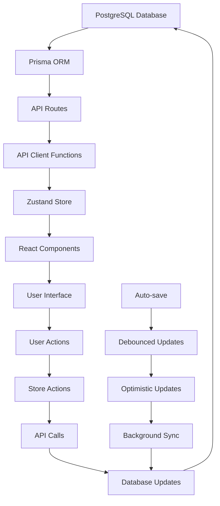
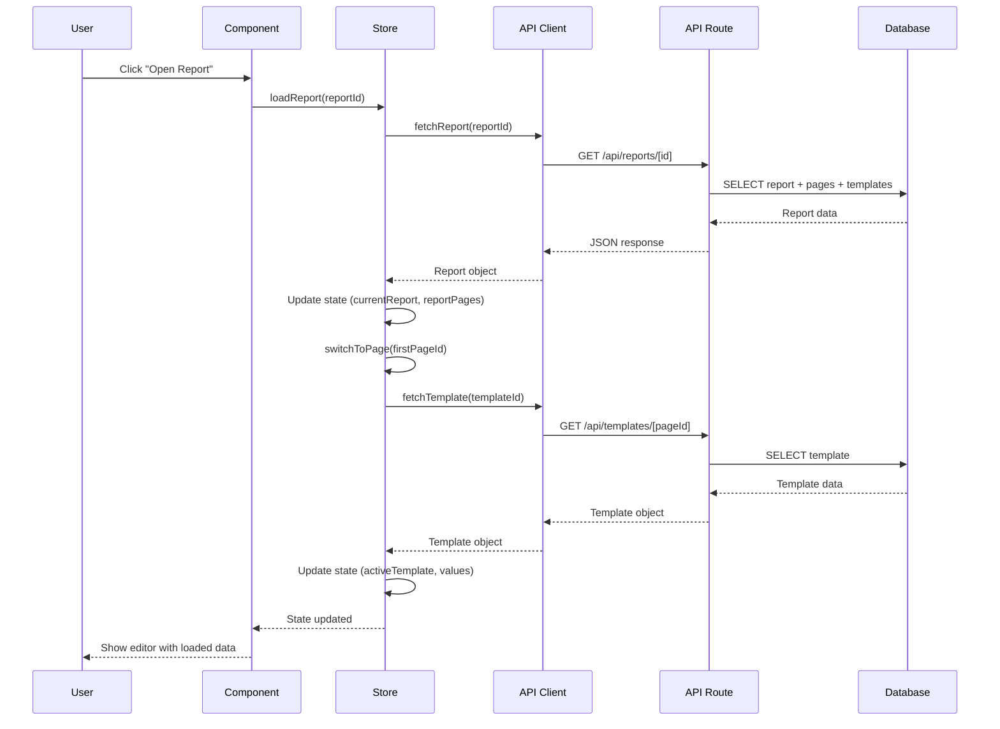
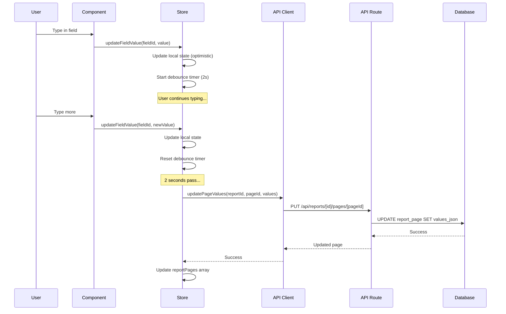
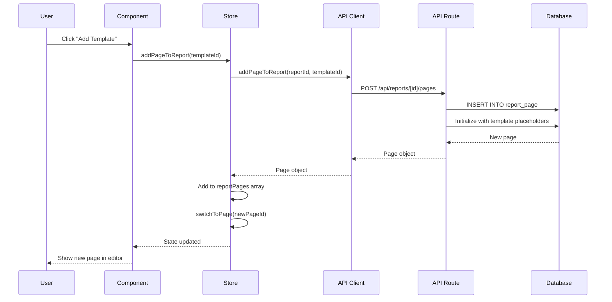

# Data Flow Architecture

## Overview

The scalable multi-report system follows a unidirectional data flow pattern with clear separation between data persistence, state management, and UI components. This document outlines how data flows through the system from database to user interface.

## Data Flow Diagram



## Data Flow Layers

### 1. Database Layer (PostgreSQL + Prisma)

**Purpose:** Persistent storage of all application data

**Components:**
- PostgreSQL database
- Prisma schema (`prisma/schema.prisma`)
- Prisma client (`lib/prisma.ts`)

**Data Models:**
- `ReportTemplate` - Template definitions
- `Report` - Report instances
- `ReportPage` - Individual pages within reports
- `ReportExport` - Export history

**Key Features:**
- ACID transactions
- JSON field support for flexible data
- Cascade deletes for data integrity
- Optimized indexes for query performance

### 2. API Layer (Next.js API Routes)

**Purpose:** Server-side data access and business logic

**Components:**
- `/app/api/templates/` - Template management
- `/app/api/reports/` - Report management
- `/app/api/reports/[id]/pages/` - Page management

**Data Flow:**
1. Receive HTTP requests
2. Validate input with Zod schemas
3. Execute database operations via Prisma
4. Return JSON responses
5. Handle errors consistently

**Key Features:**
- RESTful API design
- Input validation with Zod
- Consistent error handling
- Pagination support
- Search and filtering

### 3. Client API Layer (API Client Functions)

**Purpose:** Frontend data access abstraction

**Components:**
- `lib/api/templates.ts` - Template API client
- `lib/api/reports.ts` - Report API client

**Data Flow:**
1. Provide typed interfaces for API calls
2. Handle HTTP requests/responses
3. Transform data for frontend consumption
4. Provide error handling

**Key Features:**
- TypeScript interfaces
- Error handling
- Request/response transformation
- Reusable functions

### 4. State Management Layer (Zustand Store)

**Purpose:** Client-side state management and data synchronization

**Components:**
- `lib/store.ts` - Main store implementation

**Data Flow:**
1. Initialize with empty state
2. Load data from API on user actions
3. Maintain optimistic updates
4. Sync changes to database
5. Handle loading and error states

**Key Features:**
- Multi-report support
- Optimistic updates
- Auto-save with debouncing
- Legacy compatibility
- Loading state management

### 5. Component Layer (React Components)

**Purpose:** UI rendering and user interaction

**Components:**
- Report Dashboard (`app/components/reports/`)
- Editor Shell (`app/components/editor/`)
- Report Views (`app/components/report-pages/`)

**Data Flow:**
1. Subscribe to store state
2. Render UI based on current state
3. Handle user interactions
4. Dispatch actions to store
5. Show loading/error states

## Detailed Data Flow Scenarios

### Scenario 1: Loading a Report



### Scenario 2: Auto-saving Field Changes



### Scenario 3: Adding a Page to Report



## State Management Patterns

### 1. Optimistic Updates

The store implements optimistic updates for better user experience:

```typescript
// Update local state immediately
set({ values: newValues });

// Save to database in background
saveTimeout = setTimeout(async () => {
  await updatePageValues(currentReportId, currentPageId, values);
}, 2000);
```

### 2. Debounced Auto-save

Field changes are debounced to avoid excessive API calls:

- User types → Update local state immediately
- Start/reset 2-second timer
- After 2 seconds of inactivity → Save to database
- Show saving indicator during API call

### 3. Loading States

The store manages loading states for different operations:

```typescript
interface EditorState {
  isLoading: boolean;    // Loading reports/templates
  isSaving: boolean;     // Saving changes
  currentReportId: string | null;
  currentReport: ReportDB | null;
  // ... other state
}
```

### 4. Error Handling

Errors are handled at multiple levels:

1. **API Level:** Zod validation, database errors
2. **Store Level:** Try-catch blocks, error state
3. **Component Level:** Error boundaries, user feedback

## Data Transformation

### Database → API Response

```typescript
// Database model
interface ReportTemplateDB {
  fieldsJson: any;  // Raw JSON
  metadata: any;    // Raw JSON
}

// API response
interface TemplateResponse {
  fieldsJson: TemplateField[];  // Parsed JSON
  metadata: TemplateMetadata;   // Parsed JSON
}
```

### API Response → Store State

```typescript
// API response
interface ReportWithPages {
  pages: ReportPageDB[];
}

// Store state
interface EditorState {
  reportPages: ReportPageDB[];
  values: FieldValues;  // Extracted from current page
}
```

### Store State → Component Props

```typescript
// Store state
const values = useEditorStore(s => s.values);
const template = useEditorStore(s => s.activeTemplate);

// Component props
<GenericReportView 
  template={template} 
  values={values} 
/>
```

## Performance Optimizations

### 1. Lazy Loading

- Templates are loaded on-demand when switching pages
- Report pages are loaded only when needed
- Components use dynamic imports

### 2. Pagination

- API endpoints support pagination
- Large lists are loaded in chunks
- Infinite scroll can be implemented

### 3. Caching

- Store maintains loaded data in memory
- Templates are cached after first load
- Optimistic updates reduce perceived latency

### 4. Debouncing

- Auto-save is debounced to reduce API calls
- Search inputs are debounced
- Form validation is debounced

## Error Recovery

### 1. Network Errors

- Retry failed API calls
- Show offline indicators
- Queue changes for later sync

### 2. Validation Errors

- Show field-level error messages
- Prevent invalid data submission
- Provide helpful error descriptions

### 3. State Corruption

- Reset to last known good state
- Reload data from server
- Provide recovery options

## Future Enhancements

### 1. Real-time Updates

- WebSocket connections for live collaboration
- Conflict resolution for concurrent edits
- Presence indicators

### 2. Offline Support

- Service worker for offline functionality
- Local storage for offline changes
- Sync when connection restored

### 3. Advanced Caching

- Redis for server-side caching
- CDN for static assets
- Browser caching strategies
