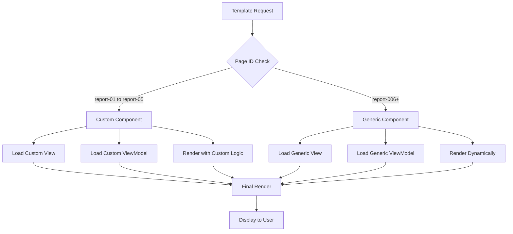

# Template System Architecture

## Overview

The template system is the core of the scalable multi-report editor. It supports both custom components for specific templates and a generic rendering system for dynamic templates. This architecture allows for 100+ report templates while maintaining performance and flexibility.

## Template System Components

### 1. Template Registry (`app/components/report-pages/registry.ts`)

The registry manages template-to-component mapping with dynamic discovery.

```typescript
// Custom components for reports 1-5 (backward compatibility)
const customRegistry = {
  "report-01": { connected: ConnectedReport01, view: Report01View, ... },
  "report-02": { connected: ConnectedReport02, view: Report02View, ... },
  // ... reports 3-5
};

// Dynamic registry function
export function getTemplateRegistryEntry(pageId: string, template?: ReportTemplateDB): TemplateRegistryEntry {
  // Check for custom component first
  if (pageId in customRegistry) {
    return customRegistry[pageId];
  }
  
  // Fall back to generic components
  return {
    connected: GenericConnected,
    view: GenericView,
    viewModel: (values) => buildGenericViewModel(values, template.fieldsJson),
    metadata: template.metadata
  };
}
```

**Key Features:**
- Custom components for reports 1-5 (backward compatibility)
- Generic components for reports 6+ (dynamic rendering)
- Automatic fallback to generic rendering
- Metadata-driven component selection

### 2. Generic View Component (`app/components/report-pages/GenericReportView.tsx`)

Renders any template dynamically based on field definitions.

```typescript
interface GenericReportViewProps {
  template: {
    pageId: string;
    title: string;
    fields: TemplateField[];
  };
  values: Record<string, string>;
}
```

**Rendering Logic:**
1. **Field Grouping:** Groups fields by base section (first part of dotted ID)
2. **Type-based Rendering:** Renders each field based on its type
3. **HTML Support:** Supports HTML formatting in multiline fields
4. **Conditional Rendering:** Only renders sections with content

**Supported Field Types:**
- `text` - Plain text display
- `multiline` - HTML-formatted text
- `link` - Clickable links with URL validation
- `date` - Date formatting
- `badge` - Styled badge component
- `image` - Image display with responsive sizing
- `attachments` - JSON array of attachments
- `authors` - JSON array of authors
- `contents` - JSON array of table of contents

### 3. View Model Factory (`app/components/report-pages/viewModelFactory.ts`)

Transforms raw field values into structured data for components.

```typescript
export function buildGenericViewModel(values: FieldValues, fields: TemplateField[]): Record<string, any> {
  const result: Record<string, any> = {};
  
  fields.forEach(field => {
    const value = values[field.id];
    
    switch (field.type) {
      case 'attachments':
      case 'authors':
      case 'contents':
        // Parse JSON arrays
        try {
          result[field.id] = value ? JSON.parse(value) : [];
        } catch (e) {
          result[field.id] = [];
        }
        break;
      default:
        result[field.id] = value || '';
        break;
    }
  });
  
  return result;
}
```

**Key Features:**
- Type-aware value transformation
- JSON parsing for complex field types
- Error handling for malformed data
- Default value handling

### 4. Generic Connected Component (`app/components/report-pages/GenericConnectedReport.tsx`)

Connects the generic view to the Zustand store.

```typescript
interface GenericConnectedReportProps {
  template: ReportTemplateDB;
}

export default function GenericConnectedReport({ template }: GenericConnectedReportProps) {
  const values = useEditorStore((s) => s.values);
  
  const templateForView = {
    pageId: template.pageId,
    title: template.title,
    fields: template.fieldsJson as any[]
  };
  
  return <GenericReportView template={templateForView} values={values} />;
}
```

## Template Rendering Decision Tree



## Template Structure

### Database Template Format

Templates are stored in the database with this structure:

```typescript
interface ReportTemplateDB {
  id: string;
  pageId: string;        // "report-001", "report-002", etc.
  title: string;         // Display title
  category: string;      // "project-documentation", "financial", etc.
  version: string;       // "1.0.0"
  fieldsJson: TemplateField[];  // Field definitions
  metadata: {
    fieldCount: number;
    complexity: "simple" | "intermediate" | "complex";
    description: string;
  };
}
```

### Field Definition Format

Each field in a template follows this structure:

```typescript
interface TemplateField {
  id: string;           // Unique identifier (e.g., "header.project")
  label: string;        // Display label
  type: FieldType;      // Field type
  placeholder?: string; // Placeholder text
  helpText?: string;    // Help text
  required?: boolean;   // Required flag
  validation?: {
    pattern?: string;   // Regex pattern
    minLength?: number; // Minimum length
    maxLength?: number; // Maximum length
    message?: string;   // Error message
  };
}
```

## Rendering Process

### 1. Template Loading

```typescript
// Store loads template from database
const template = await fetchTemplate(templateId);

// Registry determines component type
const entry = getTemplateRegistryEntry(template.pageId, template);

// Component is rendered
const Component = entry.connected;
return <Component template={template} />;
```

### 2. Field Processing

```typescript
// Group fields by section
const fieldGroups = template.fields.reduce((groups, field) => {
  const baseId = field.id.split('.')[0];
  if (!groups[baseId]) groups[baseId] = [];
  groups[baseId].push(field);
  return groups;
}, {});

// Render each group as a section
Object.entries(fieldGroups).forEach(([groupName, fields]) => {
  renderFieldGroup(groupName, fields);
});
```

### 3. Field Rendering

```typescript
const renderField = (field: TemplateField, value: any) => {
  switch (field.type) {
    case 'text':
      return <Text>{value}</Text>;
    case 'multiline':
      return <div dangerouslySetInnerHTML={{ __html: value }} />;
    case 'link':
      return <a href={value} target="_blank">{value}</a>;
    case 'badge':
      return <Badge>{value}</Badge>;
    // ... other types
  }
};
```

## Custom vs Generic Components

### Custom Components (Reports 1-5)

**Advantages:**
- Full control over layout and styling
- Optimized for specific use cases
- Complex interactions and animations
- Custom business logic

**Use Cases:**
- Complex layouts with specific positioning
- Interactive elements
- Custom data visualizations
- Legacy templates requiring specific styling

**Example:**
```typescript
// Custom Report05View with specific layout
export default function Report05View({ stakeholder1Org, stakeholder1Role, ... }) {
  return (
    <div className="min-h-screen bg-white">
      <div className="border-b border-gray-300 bg-white">
        {/* Custom header layout */}
      </div>
      <Page>
        <Stack gap="lg">
          {/* Custom stakeholder table */}
          <Table headers={[...]} rows={stakeholderData} />
        </Stack>
      </Page>
    </div>
  );
}
```

### Generic Components (Reports 6+)

**Advantages:**
- Automatic support for any template structure
- Consistent styling and behavior
- Easy to maintain and update
- Scales to unlimited templates

**Use Cases:**
- Standard form layouts
- Simple data display
- Rapid template creation
- Bulk template generation

**Example:**
```typescript
// Generic rendering for any template
export default function GenericReportView({ template, values }) {
  const fieldGroups = groupFieldsBySection(template.fields);
  
  return (
    <div className="min-h-screen bg-white">
      {hasHeader && <HeaderSection />}
      <Page>
        <Stack gap="lg">
          {Object.entries(fieldGroups).map(([groupName, fields]) => 
            renderFieldGroup(groupName, fields)
          )}
        </Stack>
      </Page>
    </div>
  );
}
```

## Template Categories

### Project Documentation
- Project Register (report-01)
- Table of Contents (report-03)
- Contents Continuation (report-04)
- Project Overview (report-05)

### Safety & Quality
- Safety Inspection Checklist (report-006)
- Quality Control Checklist (report-010)
- Punch List (report-017)
- Inspection Request (report-023)

### Financial
- Budget Summary (report-011)
- Change Order Request (report-012)

### Technical
- Equipment Usage Report (report-009)
- Site Photos Documentation (report-013)
- Environmental Compliance (report-021)
- As-Built Documentation (report-024)

## Performance Considerations

### 1. Component Loading

- Custom components use dynamic imports
- Generic components are loaded once and reused
- Lazy loading prevents unnecessary bundle size

### 2. Rendering Optimization

- Fields are grouped to reduce DOM nodes
- Conditional rendering prevents empty sections
- Memoization for expensive calculations

### 3. Memory Management

- Templates are cached after first load
- Generic components share instances
- Cleanup on component unmount

## Validation and Error Handling

### 1. Field Validation

```typescript
export function validateFieldValues(values: FieldValues, fields: TemplateField[]): ValidationResult {
  const errors: string[] = [];
  
  fields.forEach(field => {
    const value = values[field.id];
    
    // Required field validation
    if (field.required && (!value || value.trim() === '')) {
      errors.push(`Field "${field.label}" is required`);
    }
    
    // Type-specific validation
    switch (field.type) {
      case 'date':
        if (!isValidDate(value)) {
          errors.push(`Field "${field.label}" must be a valid date`);
        }
        break;
      case 'link':
        if (!isValidUrl(value)) {
          errors.push(`Field "${field.label}" must be a valid URL`);
        }
        break;
    }
  });
  
  return { isValid: errors.length === 0, errors };
}
```

### 2. Error Recovery

- Fallback to generic rendering if custom component fails
- Graceful degradation for missing fields
- Error boundaries for component failures

## Future Enhancements

### 1. Template Builder

- Visual template editor
- Drag-and-drop field creation
- Real-time preview
- Template sharing

### 2. Advanced Rendering

- Custom layout engines
- Conditional field display
- Dynamic field generation
- Template inheritance

### 3. Performance Improvements

- Server-side rendering
- Template compilation
- Caching strategies
- Bundle optimization
