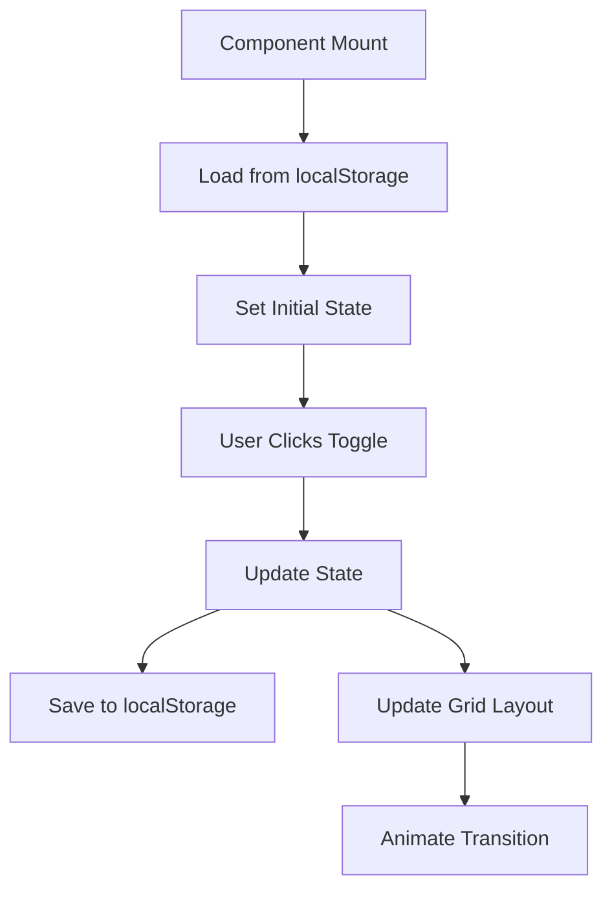

# Editor Layout and UI Improvements

## Overview

This document outlines the comprehensive improvements made to the editor's layout, user experience, and visual design to create a professional construction industry-focused interface.

## Architecture

### Layout System

The editor uses a responsive CSS Grid layout with three main sections:

```
┌─────────────────────────────────────────────────────────────┐
│                    Header (64px)                            │
├─────────┬──────────────┬────────────────────────────────────┤
│         │              │                                    │
│ Sidebar │    Form      │           Preview                  │
│ (280px) │   (350px)    │         (flexible)                 │
│         │              │                                    │
│         │              │                                    │
└─────────┴──────────────┴────────────────────────────────────┘
```

### Grid Configuration

- **Expanded Layout**: `grid-cols-[280px_350px_1fr]`
- **Collapsed Layout**: `grid-cols-[40px_350px_1fr]`
- **Header Height**: `64px` (increased from 56px for better proportions)

## Key Features

### 1. Collapsible Sidebar

**Implementation:**
- State managed with React `useState`
- Persisted in `localStorage` for user preference
- Smooth CSS transitions (200ms duration)
- Toggle button with clear visual indicators

**State Management Flow:**


**Benefits:**
- Maximizes preview space when needed
- Maintains user preference across sessions
- Smooth animations enhance UX

### 2. Professional Design System

**Color Palette:**
- Primary: Deep engineering blue (`#1e40af`)
- Secondary: Lighter engineering blue (`#3b82f6`)
- Accent: Construction orange (`#f59e0b`)
- Success: Engineering green (`#059669`)
- Neutrals: Professional gray scale

**Typography:**
- Font: Inter (professional, readable)
- Hierarchy: Clear heading levels
- Spacing: Consistent line heights and letter spacing

**Components:**
- Professional input styling with focus states
- Card-based layout with subtle shadows
- Gradient backgrounds for visual depth
- Construction-themed accent colors

### 3. Realistic Placeholder Data

**Data Structure:**
```json
{
  "id": "field.id",
  "label": "Field Label",
  "type": "text",
  "placeholder": "Realistic sample data here"
}
```

**Content Examples:**
- Project titles: "Brampton Watermain Replacement Project"
- Organizations: "City of Brampton Engineering Department"
- Addresses: Real municipal addresses
- Document numbers: Engineering format (ENG-2025-001)

**Benefits:**
- Helps users understand expected input format
- Provides realistic context for construction industry
- Improves form completion rates

### 4. Enhanced Form Layout

**Single Column Design:**
- Optimized for 350px width
- Better readability and usability
- Consistent spacing and alignment

**Field Grouping:**
- Logical organization by function
- Visual separation with cards
- Clear section headers

## Technical Implementation

### CSS Custom Properties

```css
:root {
  --brand-primary: #1e40af;
  --brand-secondary: #3b82f6;
  --accent-orange: #f59e0b;
  --success-green: #059669;
  --sidebar-width: 280px;
  --sidebar-collapsed-width: 40px;
  --form-width: 350px;
}
```

### Professional Component Classes

```css
.professional-input {
  /* Enhanced input styling with focus states */
}

.professional-btn {
  /* Consistent button styling */
}

.professional-card {
  /* Card-based layout components */
}
```

### State Management

**Sidebar State:**
```typescript
const [sidebarCollapsed, setSidebarCollapsed] = useState(false);

// Load from localStorage
useEffect(() => {
  const saved = localStorage.getItem('editor-sidebar-collapsed');
  if (saved !== null) {
    setSidebarCollapsed(JSON.parse(saved));
  }
}, []);

// Save to localStorage
useEffect(() => {
  localStorage.setItem('editor-sidebar-collapsed', JSON.stringify(sidebarCollapsed));
}, [sidebarCollapsed]);
```

## User Experience Improvements

### 1. Visual Hierarchy
- Clear section separation
- Consistent spacing and typography
- Professional color scheme
- Construction industry theming

### 2. Interaction Design
- Smooth transitions (150-200ms)
- Hover states for all interactive elements
- Clear focus indicators
- Loading states with animations

### 3. Responsive Design
- Optimized for various screen sizes
- Collapsible sidebar for space efficiency
- Flexible grid layout
- Professional scrollbar styling

### 4. Accessibility
- High contrast ratios
- Clear focus indicators
- Semantic HTML structure
- Keyboard navigation support

## Performance Considerations

### 1. CSS Transitions
- Hardware-accelerated properties
- Optimized transition timing
- Minimal repaints and reflows

### 2. State Management
- Efficient React state updates
- localStorage operations with error handling
- Minimal re-renders

### 3. Bundle Size
- CSS custom properties for maintainability
- Reusable component classes
- Optimized SVG icons

## Future Enhancements

### 1. Additional Layout Options
- Full-screen preview mode
- Split-screen editing
- Customizable panel sizes

### 2. Advanced Theming
- Dark mode support
- Custom color schemes
- Industry-specific themes

### 3. Enhanced Interactions
- Drag-and-drop panel resizing
- Keyboard shortcuts
- Advanced sidebar customization

## Browser Support

- Modern browsers with CSS Grid support
- CSS Custom Properties support
- localStorage API support
- ES6+ JavaScript features

## Testing Considerations

### 1. Layout Testing
- Various screen sizes
- Sidebar collapse/expand states
- Grid layout responsiveness

### 2. State Persistence
- localStorage availability
- State restoration on reload
- Error handling for storage failures

### 3. Visual Regression
- Component styling consistency
- Animation performance
- Cross-browser compatibility

## Conclusion

The layout improvements provide a professional, construction industry-focused interface that maximizes usability while maintaining visual appeal. The collapsible sidebar, realistic placeholder data, and professional design system create an excellent user experience for engineering document creation.

The implementation follows modern web development best practices with proper state management, performance optimization, and accessibility considerations.
